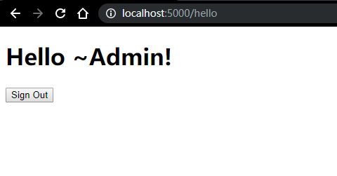

# spring boot 使用Security 进行用户访问控制

*前言* <br/>
spring security 可以对网站进行用户访问控制（验证|`authentication`）和用户授权(`authorization`)。两者也在[springboot 手册](https://spring.io/guides/topicals/spring-security-architecture)中明说到：``` authentication (who are you?) and authorization (what are you allowed to do?)```。用户授权结合[OAuth](https://oauth.net/)进行api或者第三方接入控制授权（授权），本文使用security进行用户登录，验证用户合法性（验证）。

*参考：*<br/>
1、官网，[网站安全控制](https://spring.io/guides/gs/securing-web/);<br/>
2、博客，[用户登录验证a](https://blog.csdn.net/u014553029/article/details/86690622);[用户登录验证b](https://blog.csdn.net/wanderlustLee/article/details/80032177)

# 1、创建不受访问限制的项目

## 1.1、初始化项目
在[Spring Initializr](https://start.spring.io/) 或者编辑器中生成空白项目，maven依赖添加web和thymeleaf就可以了，如下图：


## 1.2、创建两个展示界面
```html
src/main/resources/templates/home.html
<!doctype html>
<html lang="en" xmlns="http://www.w3.org/1999/xhtml" xmlns:th="https://www.thymeleaf.org"
      xmlns:sec="https://www.thymeleaf.org/thymeleaf-extras-springsecurity3">
<head>
	<meta charset="UTF-8" />
	<title>home</title>
</head>
<body>
	<h1>Home Page</h1>
	<p>click <a th:href="@{/hello}">here</a> to see a greeting.</p>
</body>
</html>
```

希望通过上面这个界面跳转到 ```/hello```，hello界面内容如下：
```html
src/main/resources/templates/hello.html
<!DOCTYPE html>
<html xmlns="http://www.w3.org/1999/xhtml" xmlns:th="https://www.thymeleaf.org"
      xmlns:sec="https://www.thymeleaf.org/thymeleaf-extras-springsecurity3">
    <head>
        <title>Hello World!</title>
    </head>
    <body>
        <h1>Hello world!</h1>
    </body>
</html>
```
页面创建完成后，配置路由控制界面跳转，通过配置文件方式添加路由：
```java
package com.noel.handbook.accesscontroll.config;

import org.springframework.context.annotation.Configuration;
import org.springframework.web.servlet.config.annotation.ViewControllerRegistry;
import org.springframework.web.servlet.config.annotation.WebMvcConfigurer;

@Configuration
public class MvcConfig implements WebMvcConfigurer {

	@Override
	public void addViewControllers(ViewControllerRegistry registry) {
		// TODO Auto-generated method stub
		registry.addViewController("/home").setViewName("/home");
		registry.addViewController("/").setViewName("/home");
		registry.addViewController("/login").setViewName("/login");
		registry.addViewController("/hello").setViewName("/hello");
	}
}
```
通过重写```WebMvcConfigurer``` 的```addViewControllers```方法，添加四个路由，login界面在下面创建。<br/>
到现在，可以运行项目，浏览器输入地址`ip:端口/` 或者 `ip:端口/home`查看界面输出，界面之间和url地址之间可以随意跳转。

# 2、添加security

我们想控制用户需要登录后才显示hello界面，并输出登录者的用户名。<br/>
pom添加如下依赖：
```xml
pom.xml
<dependency>
    <groupId>org.springframework.boot</groupId>
    <artifactId>spring-boot-starter-security</artifactId>
</dependency>
```
然后我们限制重启项目，可以看见控制台会输出一个密码。访问任意界面会显示一个springboot的默认登录界面：

## 2.1、 设置访问控制
```java
package com.noel.handbook.accesscontroll.config;

import org.springframework.context.annotation.Bean;
import org.springframework.context.annotation.Configuration;
import org.springframework.security.config.annotation.web.builders.HttpSecurity;
import org.springframework.security.config.annotation.web.configuration.EnableWebSecurity;
import org.springframework.security.config.annotation.web.configuration.WebSecurityConfigurerAdapter;
import org.springframework.security.core.userdetails.User;
import org.springframework.security.core.userdetails.UserDetails;
import org.springframework.security.core.userdetails.UserDetailsService;
import org.springframework.security.provisioning.InMemoryUserDetailsManager;

@Configuration
@EnableWebSecurity
public class WebSecurityConfig extends WebSecurityConfigurerAdapter {

	@Bean
	@Override
	protected UserDetailsService userDetailsService() {
		// TODO Auto-generated method stub
		UserDetails user = User.withDefaultPasswordEncoder().username("noel").password("123").roles("USER").build();
		return new InMemoryUserDetailsManager(user);
	}

	@Override
	protected void configure(HttpSecurity http) throws Exception {
		// TODO Auto-generated method stub
		http
		.authorizeRequests()
		.antMatchers("/", "/home").permitAll()
		.anyRequest().authenticated()
		.and()
		.formLogin()
		.loginPage("/login").permitAll()
		.and()
		.logout().permitAll();
	}
}
```
添加了一个继承`WebSecurityConfigurerAdapter` 的配置类，重写两个方法添加一些配置，并添加注解`@EnableWebSecurity`，开启Spring Security。<br/>
`userDetailsService()`这里实现了一个存在于内存中的用户，用户名是`noel`，密码是`123`,该用户的角色是`USER`，该角色spring 有自己的一套方法，一般以`ROLE_`开头的字符串说明。*之后进行用户信息在数据库中的验证实现。* By the way, 不要忘了方法上的`@Bean`注解，不添加会无法成功登录。<br/>
`configure(HttpSecurity http)`定义了路径`/`和`/home`不需要访问控制，其它路径需要认证之后才能访问。登录成功后会跳转到用户之前想要访问的页面，`loginPage("/login")`自定义了一个用户登录界面，就不会是刚才的默认登录界面。
## 2.2、自定义登录界面
```html
src/main/resources/templates/login.html
<!doctype html>
<html lang="en" xmlns="http://www.w3.org/1999/xhtml" xmlns:th="https://www.thymeleaf.org"
      xmlns:sec="https://www.thymeleaf.org/thymeleaf-extras-springsecurity3">
<head>
    <meta charset="UTF-8" />
    <title>login</title>
</head>
<body>
    <div th:if="${param.error}">无效用户名和密码</div>
    <div th:if="${param.logout}">已登出</div>
    <form th:action="@{/login}" method="post">
        <div><label for="username">User Name: <input type="text" name="username" /></label></div>
        <div><label for="password">password: <input type="password" name="password" /></label></div>
        <div><input type="submit" value="Sign In"/></div>
    </form>
</body>
</html>
```
用户通过访问上面页面，在表单输入用户姓名`noel`、密码`123`后提交到`/login`进行登录验证，登录成功后表示验证成，否则跳转到`/login?logout`，返回错误信息。
## 2.3、 用户等出
更改hello界面，显示登录成功后的用户姓名和登出按钮。
```html
<!DOCTYPE html>
<html xmlns="http://www.w3.org/1999/xhtml" xmlns:th="https://www.thymeleaf.org"
      xmlns:sec="https://www.thymeleaf.org/thymeleaf-extras-springsecurity3">
    <head>
        <title>Hello World!</title>
    </head>
    <body>
        <h1 th:inline="text">Hello [[${#httpServletRequest.remoteUser}]]!</h1>
        <form th:action="@{/logout}" method="post">
            <input type="submit" value="Sign Out"/>
        </form>
    </body>
</html>
```
`/logout`登出成功会跳转到`/login?logout`。

# 3、验证mysql数据库存放的用户
## 3.1、相关配置
因为平时我们可能比较频繁与写数据库操作逻辑，所以，下面的主要以代码为主，逻辑应该比较清晰。<br/>
用户表：三个字段，其中`type`为用户权限等级，0为管理员，1为普通用户，在`用户权限检查(CustomUserDetailsService)`中会用到。添加了一个admin用户，密码是123456 的BCrypt加密结果
```mysql
DROP TABLE IF EXISTS `user`;
CREATE TABLE `user` (
  `Id` int(11) NOT NULL AUTO_INCREMENT,
  `userName` varchar(255) DEFAULT NULL COMMENT '姓名',
  `password` varchar(255) DEFAULT NULL COMMENT '密码',
  `type` INTEGER DEFAULT 0,
  PRIMARY KEY (`Id`)
) ENGINE=MyISAM AUTO_INCREMENT=4 DEFAULT CHARSET=utf8 COMMENT='用户表';

INSERT INTO `user` VALUES ('0', 'Admin', '$2a$10$7HMxhcXQXp5vtVm.fmWyK.NUYNrB1.6/FUfq3PiFnOnenCp/CVIDa', '1');
```
添加`mysql`和`mybatis maven` 依赖:
```xml
pom.xml
<dependency>
    <groupId>mysql</groupId>
    <artifactId>mysql-connector-java</artifactId>
    <scope>runtime</scope>
</dependency>
<dependency>
    <groupId>org.mybatis.spring.boot</groupId>
    <artifactId>mybatis-spring-boot-starter</artifactId>
    <version>2.1.0</version>
</dependency>
```
yml配置：设置数据库访问和mapper位置。
```yml
spring:
  datasource:
    url: jdbc:mysql://ip:3306/数据库名?useUnicode=true&charset=UTF-8&useAffectedRows=true&useSSL=false
    username: 数据库登录用户名
    password: 数据库登录密码
    driver-class-name: com.mysql.jdbc.Driver
    
mybatis:
  mapper-locations: classpath:mapper/*.xml
  type-aliases-package: com.noel.handbook.accesscontroll.model
```
数据库语句mapper/userMapper.xml: 根据用户名查询一个用户。
```xml
<?xml version = "1.0" encoding = "UTF-8"?>
<!DOCTYPE mapper PUBLIC "-//mybatis.org//DTD com.example.Mapper 3.0//EN" "http://mybatis.org/dtd/mybatis-3-mapper.dtd ">
<mapper namespace="com.noel.hadbook.accesscontroll.dao.IUser">
	<select id="getUser" resultType="com.noel.hadbook.accesscontroll.model.UserModel">
		SELECT * FROM user 
		<where>
			name like CONCAT('%','${name}','%')
		</where>
	</select>
</mapper> 
```
## 3.2、 获取用户
获取用户：
```java
package com.noel.handbook.accesscontroll.dao;

import org.apache.ibatis.annotations.Mapper;
import org.apache.ibatis.annotations.Param;

import com.noel.handbook.accesscontroll.model.UserModel;

@Mapper
public interface IUser {

	/**
	 * 根据用户名获取一个用户
	 * @return 用户信息
	 * @author noel
	 * @date 2019年9月7日
	 */
	UserModel getUser(@Param("name")String name);
}
```

```java
package com.noel.handbook.accesscontroll.model;

import lombok.AllArgsConstructor;
import lombok.Data;
import lombok.NoArgsConstructor;

@Data
@AllArgsConstructor
@NoArgsConstructor
public class UserModel {

	private String name;
	private String pwd;
	private Integer type;
}
```
## 3.3、 接入Security并验证用户

```java
/**
* <p>Title: UserDetailsService.java</p>
* <p>Description: 系统用户信息校验，权限检查</p>
* <p>Copyright: Copyright (c) 2019</p>
* <p>Company: cbpm</p>
* @author noel
* @date 2019年9月6日
 */
package com.noel.handbook.accesscontroll;

import java.util.ArrayList;
import java.util.List;

import javax.annotation.Resource;

import org.slf4j.Logger;
import org.slf4j.LoggerFactory;
import org.springframework.security.core.authority.SimpleGrantedAuthority;
import org.springframework.security.core.userdetails.User;
import org.springframework.security.core.userdetails.UserDetails;
import org.springframework.security.core.userdetails.UserDetailsService;
import org.springframework.security.core.userdetails.UsernameNotFoundException;
import org.springframework.stereotype.Service;

import com.noel.handbook.accesscontroll.dao.IUser;
import com.noel.handbook.accesscontroll.model.UserModel;

/**
 * 用户权限检查
 * @author noel
 * @date 2019年9月6日
 */
@Service
public class CustomUserDetailsService implements UserDetailsService{
	
	private static final Logger log = LoggerFactory.getLogger(CustomUserDetailsService.class);

	@Resource
	private IUser iUser;
	
	/* (non-Javadoc)
	 * @see org.springframework.security.core.userdetails.UserDetailsService#loadUserByUsername(java.lang.String)
	 */
	@Override
	public UserDetails loadUserByUsername(String arg0) throws UsernameNotFoundException {
		// TODO Auto-generated method stub
		UserModel userModel = iUser.getUser(arg0);
		log.info("验证机制里面的用户",userModel);
		if(null == userModel) {
			throw new UsernameNotFoundException("用户不存在");
		}
		List<SimpleGrantedAuthority> authorities = new ArrayList<SimpleGrantedAuthority>();
		if(userModel.getType()==0) {
			authorities.add(new SimpleGrantedAuthority("ROLE_ADMIN"));
		}else {
			//其它所有用户都认为是普通用户
			authorities.add(new SimpleGrantedAuthority("ROLE_USER"));
		}
		return new User(userModel.getName(), userModel.getPwd(), authorities);
	}

}
```
以上思路是：根据用户名从数据库获取到用户信息，以及用户权限。如果登录失败，则返回错误信息并停留在登录界面；如果登录成功，则将用户名、密码、权限封装到`SimpleGrantedAuthority`。
```java
package com.noel.handbook.accesscontroll.config;

import javax.annotation.Resource;

import org.springframework.beans.factory.annotation.Autowired;
import org.springframework.context.annotation.Configuration;
import org.springframework.security.config.annotation.authentication.builders.AuthenticationManagerBuilder;
import org.springframework.security.config.annotation.web.builders.HttpSecurity;
import org.springframework.security.config.annotation.web.configuration.EnableWebSecurity;
import org.springframework.security.config.annotation.web.configuration.WebSecurityConfigurerAdapter;
import org.springframework.security.crypto.bcrypt.BCryptPasswordEncoder;

import com.noel.handbook.accesscontroll.CustomUserDetailsService;

@Configuration
@EnableWebSecurity
public class WebSecurityConfig extends WebSecurityConfigurerAdapter {

	@Resource
	private CustomUserDetailsService userDetailsService;
	
//	@Bean
//	@Override
//	protected UserDetailsService userDetailsService() {
//		// TODO Auto-generated method stub
//		UserDetails user = User.withDefaultPasswordEncoder().username("noel").password("123").roles("USER").build();
//		return new InMemoryUserDetailsManager(user);
//	}

	@Override
	protected void configure(HttpSecurity http) throws Exception {
		// TODO Auto-generated method stub
		//...
	}

	@Override
	@Autowired
	protected void configure(AuthenticationManagerBuilder auth) throws Exception {
		// TODO Auto-generated method stub
		auth.userDetailsService(userDetailsService).passwordEncoder(new BCryptPasswordEncoder());
	}	
}
```
用户验证方法由`UserDetailsService`改为重写`WebSecurityConfigurerAdapter`的`configure(AuthenticationManagerBuilder auth)`方法，security将数据库查询的用户密码和界面传入的密码进行比较，一致则登录成功并跳转，否则停留在登录界面并返回错误信息。<br/>
结果：<br/>


源码地址： *[GITHUB](https://github.com/NoelCarlton/springboot-user-login)*